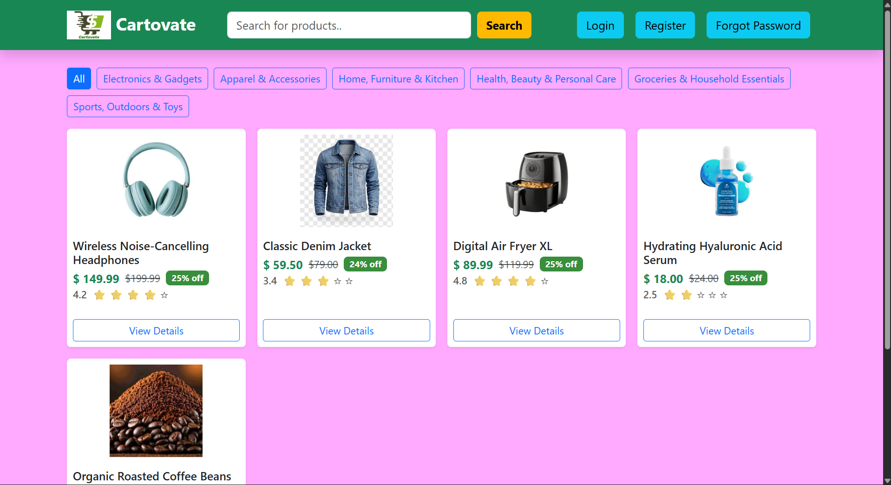
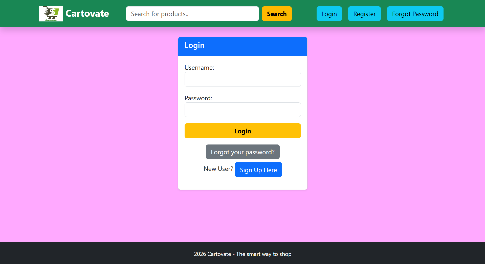
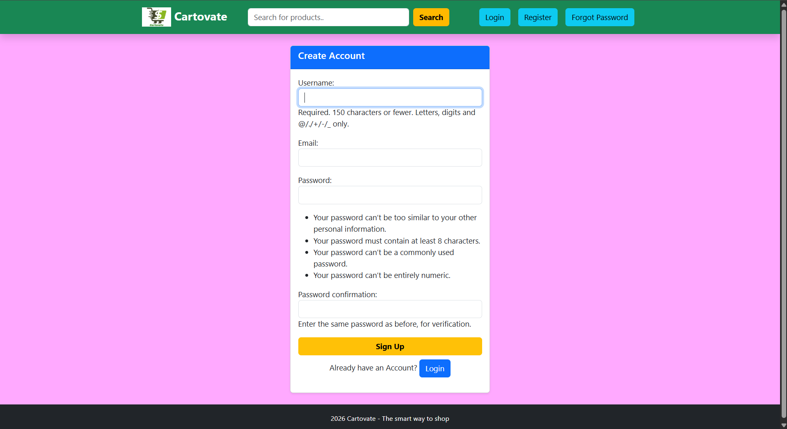
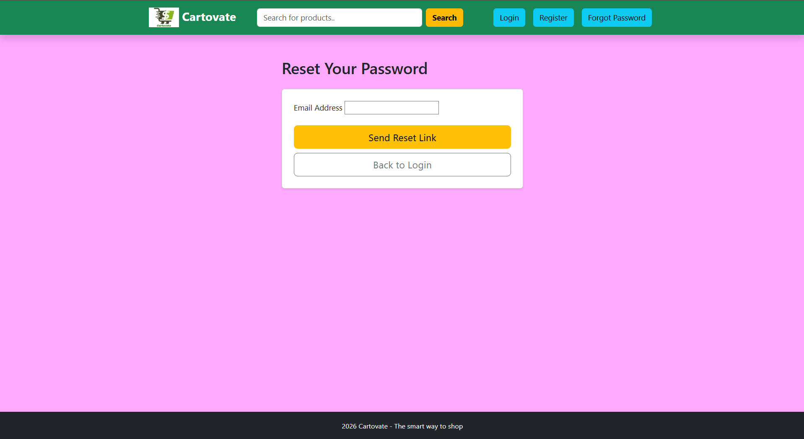
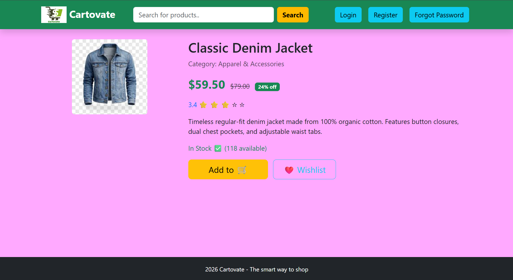
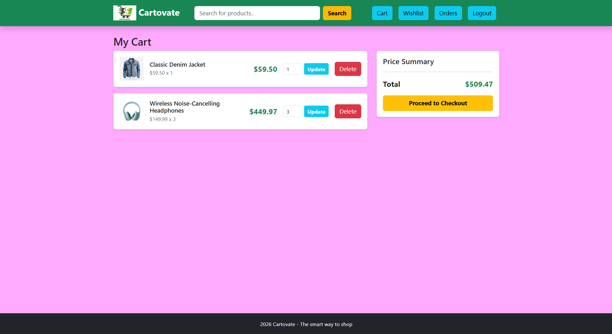
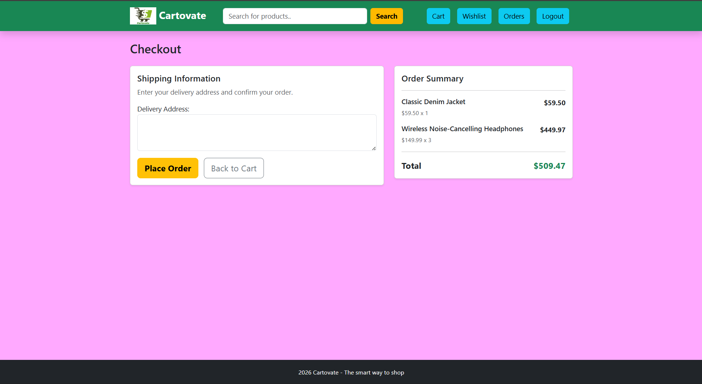

# Cartovate - E-Commerce Website

## Project Name
**Cartovate - E-Commerce Website**

## Project Overview
Cartovate is a Django-based e-commerce web application built to provide a simple and responsive online shopping experience. It includes product browsing, category-based filtering, search, product details, cart management, wishlist support, checkout, order history, and user authentication features.  

The project uses a sample dataset stored in SQLite with product and category records, along with uploaded media assets for product and category images.

## Tech Stack
- **Frontend:** HTML, CSS, Bootstrap 5
- **Backend:** Python, Django
- **Database:** SQLite3
- **Authentication:** Django built-in authentication system
- **Email Handling:** Django SMTP email backend for password reset
- **Media Management:** Django media files for product and category images

## Features in the Project
- User registration, login, logout, and password reset
- Product listing page with search functionality
- Category-based filtering of products
- Product detail page with price, discount, rating, stock, and wishlist option
- Add to cart, update cart quantity, and remove from cart
- Wishlist add/remove functionality
- Checkout page with shipping address form
- Order placement and order history view
- Stock update after successful order placement
- Responsive UI using Bootstrap
- Pagination for product listings

## Role in this Project
I developed this project individually as a solo full-stack developer.  
My responsibilities included:
- Designing the Django project structure
- Creating models, views, forms, URLs, and templates
- Implementing cart, wishlist, and order logic
- Integrating authentication and password reset functionality
- Managing the sample dataset, media files, and SQLite database
- Building and styling the responsive user interface

## Screenshots of Different Web Pages in the Project

## HOMEPAGE OF CARTOVATE

## LOGIN PAGE OF CARTOVATE

## SIGN UP PAGE OF CARTOVATE

## PASSWORD RESET PAGE OF CARTOVATE

## PRODUCT DETAILS PAGE OF CARTOVATE

## CART PAGE OF CARTOVATE

## CHECKOUT PAGE OF CARTOVATE
